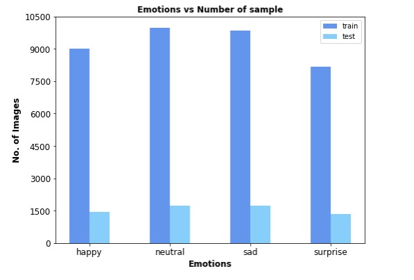
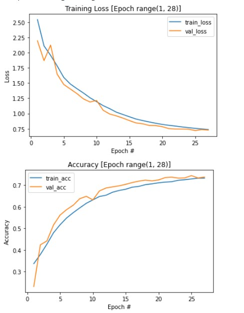
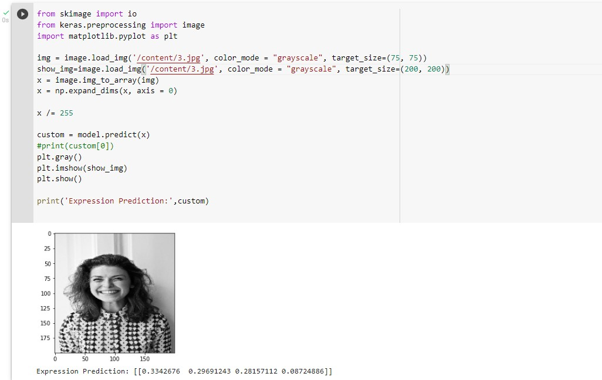
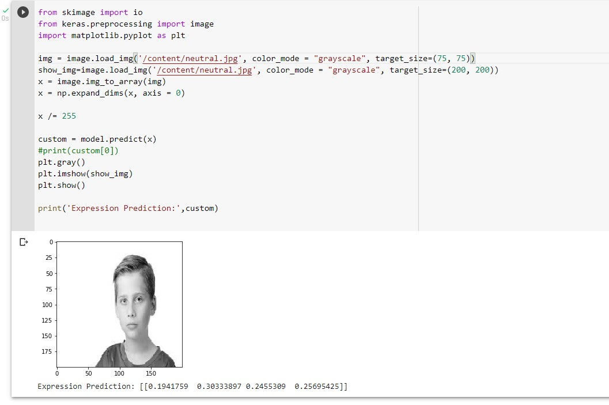
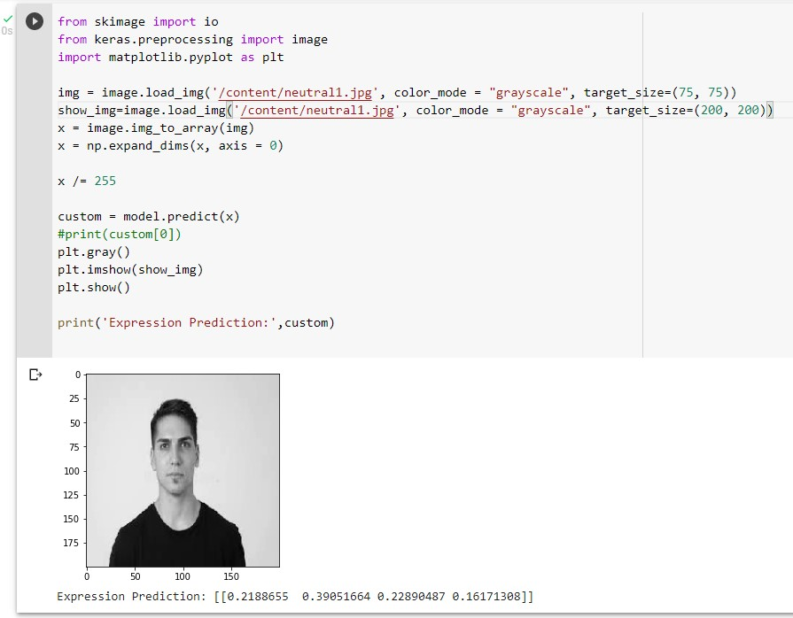
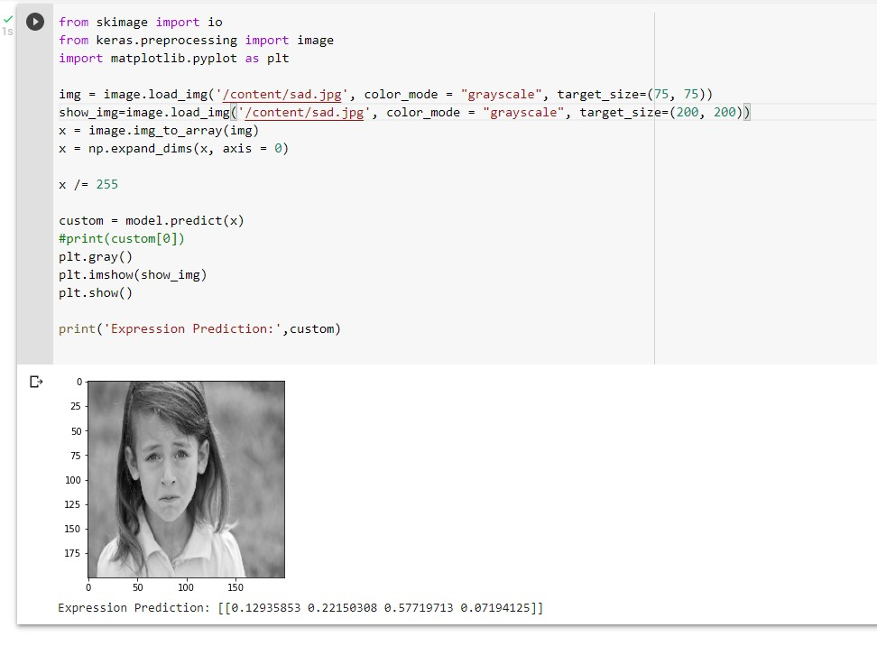
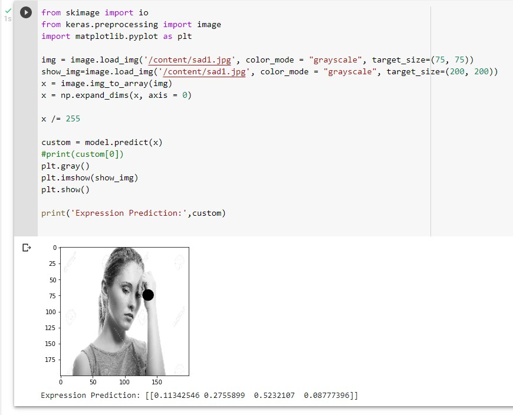
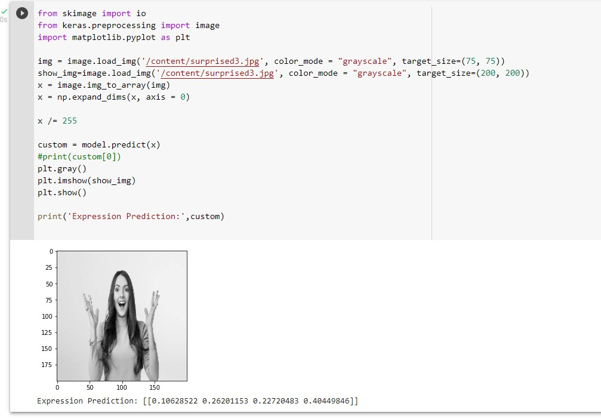
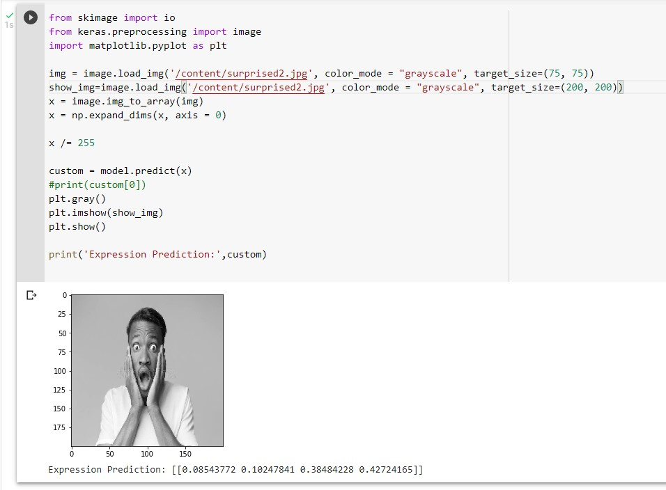

# CNN Model for Face Emotion[happy, neutral, sad and surprise] Recognition

This model is build for Final year college project named __Paana: Journal featuring NLP, HTR, and CV__ in which images posted by user during journal posts are feed to model for face emotion recognition.

## Datasets
Two datasets from kaggle is merged and images with above emotions are retrieved.
- [FER-2013](https://www.kaggle.com/datasets/msambare/fer2013)
- [AffectNet](https://www.kaggle.com/datasets/mouadriali/affectnetsample)
- [FER + AffectNet](https://www.kaggle.com/datasets/anishkulung/ferandaffectnet)

## Model Accuracy and Loss Chart

## Result Screenshots
[Note: Prediction array probabilities are in order of [happy, neutral, sad, surprise ]]
- #### Happy Prediction Results

- #### Neutral Prediction Results

- #### Sad Prediction Results

- #### Surprise Prediction Results

## References

#### Book
- [Deep Learning Patterns and Practices: Ferlitsch, Andrew](https://b-ok.asia/book/17402639/aedaa0)
#### Journal

- [L. Alzubaidi et al., "Review of deep learning: concepts, CNN architectures, challenges, applications, future directions", Journal of Big Data, vol. 8, no. 1, 2021. Available: 10.1186/s40537-021-00444-8](https://journalofbigdata.springeropen.com/articles/10.1186/s40537-021-00444-8#citeas)

#### Online
- ["Facial Emotion Detection Using CNN - Analytics Vidhya", Analytics Vidhya, 2022. [Online]. Available: https://www.analyticsvidhya.com/blog/2021/11/facial-emotion-detection-using-cnn/...](https://www.analyticsvidhya.com/blog/2021/11/facial-emotion-detection-using-cnn/)
- ["Improving Performance of Convolutional Neural Network!", Medium, 2022. [Online]. Available: https://medium.com/@dipti.rohan.pawar/improving-performance-of-convolutional-neural-network-2ecfe0207de7.](https://medium.com/@dipti.rohan.pawar/improving-performance-of-convolutional-neural-network-2ecfe0207de7)

